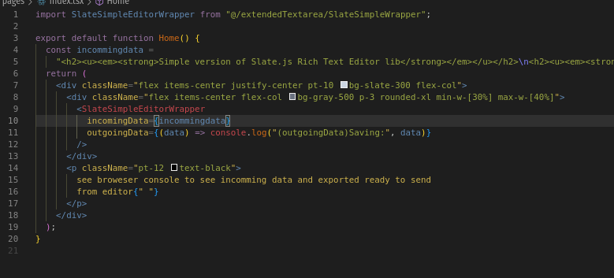

# Simple Version of Slate.js Rich Text Editor Library

Just use it without pain! ;-)

---

## How It Looks and How to Start


---

## Description

A streamlined, TypeScript-friendly implementation of the Slate.js editor with practical solutions to common issues and undocumented features for the latest version of Next.js.

This version prioritizes **stability** and **ease of use** over complex features, making it ideal for projects that need reliable rich text editing without the complexity of the full Slate.js ecosystem.

---

## Key Features and Improvements

1. **Customizable Buttons**:

   - Added functionality for clickable buttons that are easy to customize.
   - Simply import your image version of a button, and you're good to go!

2. **TypeScript Enhancements**:

   - Resolved many undocumented TypeScript issues in Next.js.

3. **Serialization and Deserialization**:

   - Seamlessly input data (e.g., text or HTML) into the editor and retrieve edited data.
   - Automatically convert values. Example:

     

4. **Mobile Toolbar Optimization**:
   - Toolbar auto-hides and auto-opens for a better mobile experience.
5. **Add Validatation to the Editor and Example how to use**:
   - simple validation like min and max length and check urls .
6. **Add example how to use with react-hook-forms**:

---

## added props :

## Customization

- If you don’t need extra features or customization and want to use the library as-is (without installing it), you can:
  - Visit the [GitHub repository](https://github.com/jaumamyfront-ender/slate-simple-editor) to copy or fork the code.
  - Copy the source files from `node_modules/slate-simple-editor/src`.

For additional features or modifications, refer to the [official Slate.js documentation](https://docs.slatejs.org).

> Original library/repo by [Ian Storm Taylor](https://github.com/ianstormtaylor/slate).

---

## Fast Start

1. **Install the library**:

   ```bash
   yarn add slate-simple-editor
   ```

2. **Copy Custom Icons**:

   - After installation, locate the library in `node_modules`.
   - Path: `node_modules/editor/public`.
   - Copy the `customIcons` folder to your public folder and use the default icons or add your own images.

3. **Add the Code**:

   **React Example**:

   ```jsx
   "use client";
   import React from "react";
   import SlateSimpleExtendedEditor from "editor/dist/extendedTextEditor";

   const incomingData = `<h2><strong>Simple version of Slate.js Rich Text Editor lib</strong></h2>`;

   export default function Home() {
     return (
       <div className="editor-container">
         <SlateSimpleExtendedEditor
           staticImages={{
             staticIcons: {
               bold: "/customIcons/white/bold.svg",
               center: "/customIcons/white/center.svg",
               dots: "/customIcons/white/dots.svg",
               h1: "/customIcons/white/h1.svg",
               h2: "/customIcons/white/h2.svg",
               italic: "/customIcons/white/italic.svg",
               left: "/customIcons/white/left.svg",
               numbers: "/customIcons/white/numbers.svg",
               right: "/customIcons/white/right.svg",
               underline: "/customIcons/white/underline.svg",
             },
             activeIcons: {
               bold: "/customIcons/green/bold.svg",
               center: "/customIcons/green/center.svg",
               dots: "/customIcons/green/dots.svg",
               h1: "/customIcons/green/h1.svg",
               h2: "/customIcons/green/h2.svg",
               italic: "/customIcons/green/italic.svg",
               left: "/customIcons/green/left.svg",
               numbers: "/customIcons/green/numbers.svg",
               right: "/customIcons/green/right.svg",
               underline: "/customIcons/green/underline.svg",
             },
           }}
           incomingData={incomingData}
           outgoingData={(data) => console.log("Saving:", data)}
         />
       </div>
     );
   }
   ```

   **Next.js Example**:

   ```jsx
   import dynamic from "next/dynamic";

   const SlateSimpleEditor = dynamic(
     () => import("editor/dist/extendedTextEditor"),
     { ssr: false }
   );

   const incomingData = `<h2><strong>Simple version of Slate.js Rich Text Editor lib</strong></h2>`;

   const SlateSimpleEditorWrapper = () => {
     const handleData = (value) => {
       console.log("Exported Data:", value);
     };

     return (
       <SlateSimpleEditor
         isTurnOnImages
         staticImages={{
           staticIcons: {
             bold: "/customIcons/white/bold.svg",
             center: "/customIcons/white/center.svg",
             dots: "/customIcons/white/dots.svg",
             h1: "/customIcons/white/h1.svg",
             h2: "/customIcons/white/h2.svg",
             italic: "/customIcons/white/italic.svg",
             left: "/customIcons/white/left.svg",
             numbers: "/customIcons/white/numbers.svg",
             right: "/customIcons/white/right.svg",
             underline: "/customIcons/white/underline.svg",
           },
           activeIcons: {
             bold: "/customIcons/green/bold.svg",
             center: "/customIcons/green/center.svg",
             dots: "/customIcons/green/dots.svg",
             h1: "/customIcons/green/h1.svg",
             h2: "/customIcons/green/h2.svg",
             italic: "/customIcons/green/italic.svg",
             left: "/customIcons/green/left.svg",
             numbers: "/customIcons/green/numbers.svg",
             right: "/customIcons/green/right.svg",
             underline: "/customIcons/green/underline.svg",
           },
         }}
         outgoingData={handleData}
         incomingData={incomingData}
       />
     );
   };

   export default SlateSimpleEditorWrapper;
   ```

4. **Enjoy!**
   - Input your data and retrieve already prepared HTML to send to the backend.

---
