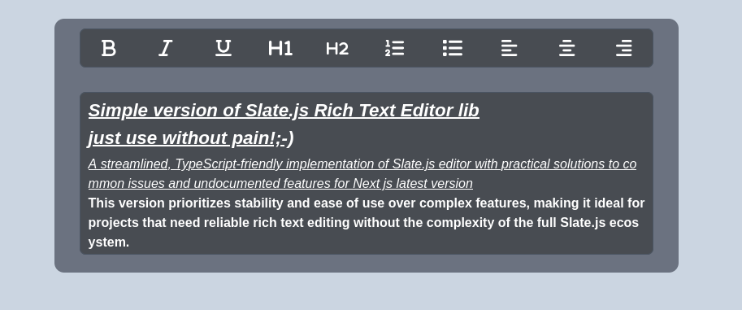

# Simple Version of Slate.js Rich Text Editor Library

Just use it without pain! ;-)

---

## How It Looks and How to Start



---

## Description

A streamlined, TypeScript-friendly implementation of the Slate.js editor with practical solutions to common issues and undocumented features for the latest version of Next.js.

This version prioritizes **stability** and **ease of use** over complex features, making it ideal for projects that need reliable rich text editing without the complexity of the full Slate.js ecosystem.

---

## Key Features and Improvements

1. **Customizable Buttons**:

   - Added functionality for clickable buttons that are easy to customize.
   - Simply import your image version of a button,set your collor on click and you're good to go!

2. **TypeScript Enhancements**:

   - Resolved many undocumented TypeScript issues in Next.js.

3. **Serialization and Deserialization**:

   - Seamlessly input data (e.g., text or HTML) into the editor and retrieve edited data.
   - Automatically convert values.

4. **Mobile Toolbar Optimization**:

   - Toolbar auto-hides and auto-opens for a better mobile experience.

5. **Add Validatation to the Editor and Example how to use**:
   - simple validation like min and max length and check urls .
6. **Add example how to use with react-hook-forms**:

---

## added props :

                incomingData=allows put you data in simple string
                outgoingData=prepared generated new data from editor
                staticImages=put the images on each icon whatever you wany
                colorOnClick=color on click when button is active
                onValidate=get data for validation and creating childrens that show you hint or something else
                enableValidation = say that you want enable function that check text length or links
                checkUrls = enable to checking urls
                minLength={5}
                maxLength={100}
                childrenLengthHint={
                  <LengthHint maxLength={1000} valueLength={length} /> = childrens hint that you put with result of error from validation
                }
                childrenErrorHint={<ErrorHint error={error} />} = childrens hint that you put with result of error from validation

## Customization

- If you don’t need extra features or customization and want to use the library as-is (without installing it), you can:
  - Visit the [GitHub repository](https://github.com/jaumamyfront-ender/slate-simple-editor) to copy or fork the code.
  - Copy the source files from `node_modules/slate-simple-editor/src`.

For additional features or modifications, refer to the [official Slate.js documentation](https://docs.slatejs.org).

> Original library/repo by [Ian Storm Taylor](https://github.com/ianstormtaylor/slate).

---

## Fast Start

1. **Install the library**:

   ```bash
   yarn add slate-simple-editor
   ```

   2.Copy The Example code(with validation / useHookForms and put/get data examples)

2. **Copy Custom Icons**:

   - After installation, locate the library in `node_modules`.
   - Path: `node_modules/editor/public`.
   - Copy the `customIcons` folder to your public folder and use the default icons or add your own images.

3. **Add the Code**:

   **Next Example**:

  ```jsx
  "use client";
  import dynamic from "next/dynamic";
  import { SlateEditorProps } from "../components/extendedTextarea/extendedTextEditor";
  import React, { useEffect, useState } from "react";
  import { useForm, FormProvider, useFormContext } from "react-hook-form";
  import { FontAwesomeIcon } from "@fortawesome/react-fontawesome";
  import { faCircleExclamation } from "@fortawesome/free-solid-svg-icons";
  import { SlateEditorProps } from "editor/dist/extendedTextEditor";
  interface LengthHintProps {
    maxLength?: number;
    valueLength: number;
  }
  interface FieldTooltipErrorProps {
    error?: any;
    className?: string;
    isAbsolute?: boolean;
    minLength?: number;
    maxLength?: number;
  }
  export interface Error {
    message: string;
    type: "maxLength" | "minLength" | "dontUseLinksinDescription";
  }
  interface ValidationResult {
    length: number;
    error: Error | undefined;
  }
  const incommingdata =
    "<h2><u><em><strong>Simple version of Slate.js Rich Text Editor lib</strong></em></u></h2>\n<h2><u><em><strong>just use without pain!;-)</strong></em></u></h2>\n<p><u><em>A streamlined, TypeScript-friendly implementation of Slate.js editor with practical solutions to common issues and undocumented features for Next js latest version</em></u></p>\n<p><strong>This version prioritizes stability and ease of use over complex features, making it ideal for projects that need reliable rich text editing without the complexity of the full Slate.js ecosystem.</strong></p>\n<p>Key Features and Improvements:</p>\n<p><em>- 1.added function that allows you click on button like switches and esy to customize them,just import you image version of button and that it!</em></p>\n<p><em>- 2.fix many typescript undocumented problems with typescript in next js</em></p>\n<p><em>- 3.add missed serealization and deserealization(put data into editor and get edited data from editor):</em></p>\n<p><em>  3.1 just put simple text or html and get converted automaticly all values inputs</em></p>\n<p><strong>note:</strong></p>\n<p><em>Customization</em></p>\n<ol><li><em>For additional features or modifications, refer to the official Slate.js documentation. This implementation focuses on common use cases while maintaining extensibility for specific needs.</em></li>\n<li><em><strong>note</strong></em><em>:original lib/repo/author =>(all origin docs)https://docs.slatejs.org (orogin author and repo)https://github.com/ianstormtaylor/slate</em></li>\n</ol>\n<ul><li><em>note:if you dont need some extra feature or customization or you wanna use it like code (not instaalnig lib) than go to my git =></em></li>\n</ul>\n";
  const productsData = [
    { id: 1, name: "Apple", description: "Fresh and juicy apple" },
    { id: 2, name: "Banana", description: "Ripe and sweet banana" },
    { id: 3, name: "Orange", description: "Juicy citrus orange" },
    { id: 4, name: "Marshmallow", description: "Soft and fluffy marshmallow" },
    { id: 5, name: "Slate Editor E", description: incommingdata },
  ];

  const SlateSimpleEditor = dynamic(
    () => import("editor/dist/extendedTextEditor"),
    {
      ssr: false,
      loading: () => (
        <div className="w-full h-[200px] bg-[rgb(72,76,82)] border border-gray-600 rounded-lg flex items-center justify-center flex-col self-center" />
      ),
    }
  );

  const SlateSimpleEditorWrapper: React.FC<SlateEditorProps> = () => {
    const methods = useForm({
      defaultValues: {
        selectedProduct: "",
        products: productsData,
      },
    });
    const { watch, setValue } = methods;
    const [selectedProductIndex, setSelectedProductIndex] = useState<any>(-1);

    const ProductSelect = () => {
      const { watch } = useFormContext();
      const selectedProductId = watch("selectedProduct");

      return (
        <div className="space-y-4 flex flex-col p-4 border rounded-md mb-6">
          <strong className="">
            exmaple-new products/description from api or new from user{" "}
          </strong>
          <select
            className="border rounded-md p-2bg-white text-black text-right "
            value={selectedProductId}
            onChange={(e) => {
              const product = productsData.find(
                (p) => p.id.toString() === e.target.value
              );

              setDecscription(product?.description || "");
            }}
          >
            <option value="" className="text-gray-700 bg-gray-100 self-end">
              🔽 Change The Product
            </option>
            {productsData.map((product) => (
              <option key={product.id} value={product.id}>
                {product.name}
              </option>
            ))}
          </select>
        </div>
      );
    };

    const description =
      watch(`products.${selectedProductIndex}.description`) || "";

    function parseDescription(value: any) {
      try {
        const parsedForUI = JSON.parse(value);
        return parsedForUI;
      } catch (error) {
        return value;
      }
    }

    const parseIncommingForEditor = JSON.stringify(parseDescription(description));
    const parsedForUI = parseDescription(description);

    const setDecscription = (data: any) => {
      const convertedToStringAllData = JSON.stringify(data);
      setValue(
        `products.${selectedProductIndex}.description`,
        convertedToStringAllData
      );
      return;
    };

    //=======================================================================================
    //validation
    const [length, setlength] = useState<any>();
    const [error, setError] = useState<any>();
    const takeValidationResult = (value: ValidationResult) => {
      setlength(value.length);
      setError(value.error);
    };

    const LengthHint: React.FC<LengthHintProps> = ({
      maxLength,
      valueLength,
    }) => {
      if (!maxLength) return null;

      return (
        <span className="absolute bottom-100 top-[450px] right-[290px] text-gray-200 text-2xs">
          {`${valueLength !== undefined ? valueLength : 0}/${maxLength}`}
        </span>
      );
    };
    //validation
    //=======================================================================================

    //example filter color
    const activeFilterBlue =
      "invert(23%) sepia(94%) saturate(1740%) hue-rotate(200deg) brightness(90%) contrast(85%)";
    const activeFilterGreen =
      "invert(31%) sepia(92%) saturate(666%) hue-rotate(100deg)";
    //example filter color

    return (
      <FormProvider {...methods}>
        <div className="flex items-center content-center flex-col bg-gray-400 justify-between min-h-[500px] w-[100%]  ">
          <ProductSelect />

          <div className="flex items-center justify-center pt-10 pb-10 bg-slate-300 flex-col w-[100%]">
            <div className="flex items-center flex-col bg-gray-500 p-3 rounded-xl min-w-[50%] max-w-[40%]">
              <SlateSimpleEditor
                key={selectedProductIndex}
                incomingData={parseIncommingForEditor}
                outgoingData={(data) => {
                  setDecscription(data);
                }}
                staticImages={{
                  staticIcons: {
                    bold: "/customIcons/white/bold.svg",
                    center: "/customIcons/white/center.svg",
                    dots: "/customIcons/white/dots.svg",
                    h1: "/customIcons/white/h1.svg",
                    h2: "/customIcons/white/h2.svg",
                    italic: "/customIcons/white/italic.svg",
                    left: "/customIcons/white/left.svg",
                    numbers: "/customIcons/white/numbers.svg",
                    right: "/customIcons/white/right.svg",
                    underline: "/customIcons/white/underline.svg",
                  },
                }}
                colorOnClick={activeFilterBlue}
                onValidate={(value) => takeValidationResult(value)}
                enableValidation
                checkUrls
                minLength={5}
                maxLength={100}
                childrenLengthHint={
                  <LengthHint maxLength={1000} valueLength={length} />
                }
                childrenErrorHint={<ErrorHint error={error} />}
              />
            </div>
          </div>
          <div className="p-4 border rounded-md  flex flex-col mt-6 mb-6">
            <strong>
              Description / how generated html text looks on other side of page :
            </strong>{" "}
            <strong>
              {" "}
              Note: don't forget to add default styles to ul/ol/li el because next
              js nullifies these default html styles.See example in globals.css!
            </strong>
            {true &&
              (() => {
                if (parsedForUI) {
                  const containsHTML = /<\/?[a-z][\s\S]*>/i.test(parsedForUI);
                  let cleanedHtml = parsedForUI
                    ?.replace(/^"(.*)"$/, "$1")
                    .replace(/\\r\\n/g, "\n")
                    .replace(/\\n/g, "\n")
                    .replace(/\\n/g, "\n")
                    .replace(/^"(.*)"$/, "$1")
                    .replace(/\\r\\n/g, "\n")
                    .replace(/\\n/g, "\n")
                    .replace(/\\"/g, '"')
                    .trim();

                  return containsHTML ? (
                    <span
                      dangerouslySetInnerHTML={{ __html: cleanedHtml }}
                      className="p-2"
                    />
                  ) : (
                    <span>{parsedForUI}</span>
                  );
                }
              })()}
          </div>
        </div>
      </FormProvider>
    );
  };
  export default SlateSimpleEditorWrapper;
  const ErrorHint = ({ error, className }: FieldTooltipErrorProps) => {
    if (!error) return null;

    return (
      <div className="flex flex-row items-center absolute top-[450px] right-120 ">
        <FontAwesomeIcon icon={faCircleExclamation} className={className} />
        <div className="flex ml-2">
          <div className="flex ml-1">{error.message}</div>
        </div>
      </div>
    );
  };

  ```

4. **Enjoy!**
- Input your data and retrieve already prepared HTML to send to the backend.

